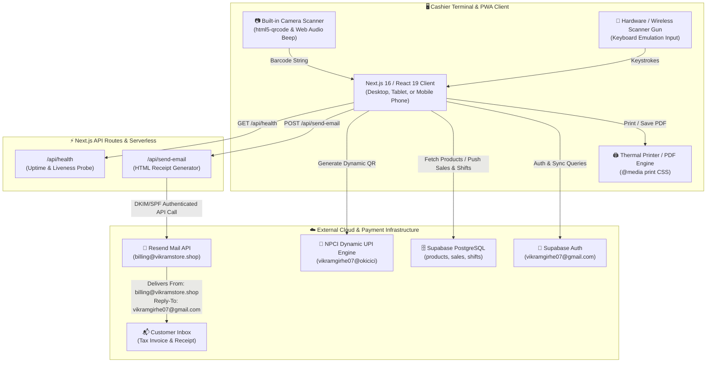
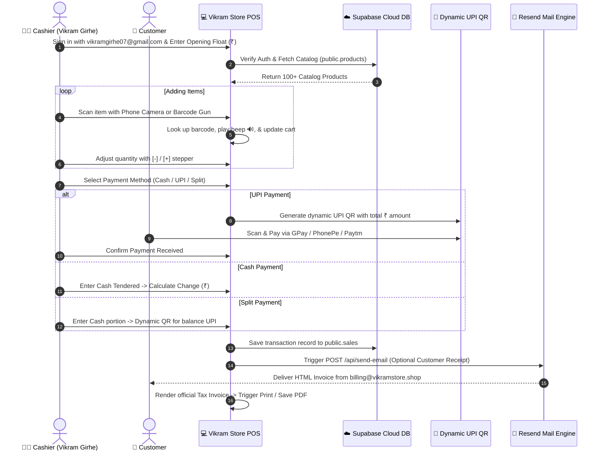

# 🏪 Vikram Store POS · Cloud Billing & Retail Management System

> **Official Point of Sale (POS) and Store Invoicing Platform for Vikram Store (`vikramstore.shop`)**  
> *Built with Next.js 16, React 19, TypeScript, Supabase PostgreSQL, Resend Transactional Mail, Dynamic UPI QR Engine, and Built-in Camera Barcode Scanner.*

---

## 📑 Table of Contents
- [🌟 System Architecture & Resource Map](#-system-architecture--resource-map)
- [🔄 Transaction & Checkout Lifecycle Diagram](#-transaction--checkout-lifecycle-diagram)
- [✨ Core Capabilities](#-core-capabilities)
- [🗄️ Supabase Cloud Database Architecture](#-supabase-cloud-database-architecture)
- [⚙️ Environment Variables & Connected Services](#️-environment-variables--connected-services)
- [🚀 Quick Start & Local Development](#-quick-start--local-development)
- [🌐 Production Deployment Guide (`vikramstore.shop`)](#-production-deployment-guide-vikramstoreshop)
- [📄 Store Invoice & Thermal Print Engine](#-store-invoice--thermal-print-engine)

---

## 🌟 System Architecture & Resource Map

The following diagram illustrates all interconnected client layers, background engines, third-party APIs, and cloud databases powering Vikram Store POS:



---

## 🔄 Transaction & Checkout Lifecycle Diagram



---

## ✨ Core Capabilities

| Feature | Description |
| :--- | :--- |
| **🔐 Supabase Cloud Auth** | Strict, secure cashier authentication limited to `vikramgirhe07@gmail.com`. |
| **📷 In-Browser Camera Scanner** | Fast barcode scanner using device camera with single-scan lock, quantity stepper `[-] [+]`, and audio feedback. |
| **💳 Dynamic UPI QR Engine** | On-the-fly dynamic UPI QR generation encoded with store VPA `vikramgirhe07@okicici` and exact bill total. |
| **💵 Split & Cash Tender** | Flexible split tender (Cash + UPI) with automatic real-time change calculation. |
| **🧾 Tax Invoice & Thermal Print** | Authentic store cash memo format compliant with 80mm thermal receipt printers and A4 PDF export. |
| **📧 Verified Domain Email Invoices** | Beautiful transactional HTML invoices sent via Resend from `billing@vikramstore.shop` with direct reply-to support. |
| **↩️ Return & Cash Refunds** | Complete return tracking, item re-stocking, negative balance receipt generation, and refund auditing. |
| **📊 Register Closing Shifts** | Shift statements comparing opening float, cash sales, refunds, UPI totals, and discrepancy calculations. |
| **📱 PWA Ready** | Progressive Web App manifest and Service Worker for offline resilience and home-screen install. |

---

## 🗄️ Supabase Cloud Database Architecture

The system connects to Supabase PostgreSQL with 3 core tables:

### 1. `public.products` (Store Inventory)
```sql
create table public.products (
  id uuid default gen_random_uuid() primary key,
  barcode text unique not null,
  name text not null,
  price numeric(10, 2) not null,
  stock integer default 100,
  category text,
  created_at timestamp with time zone default timezone('utc'::text, now()) not null
);
```

### 2. `public.sales` (Transaction Records & Invoices)
```sql
create table public.sales (
  id uuid default gen_random_uuid() primary key,
  invoice text unique not null,
  date timestamp with time zone not null,
  total numeric(10, 2) not null,
  method text not null,
  cash_amount numeric(10, 2),
  upi_amount numeric(10, 2),
  received numeric(10, 2),
  change numeric(10, 2),
  items jsonb default '[]'::jsonb,
  is_return boolean default false,
  original_invoice text,
  created_at timestamp with time zone default timezone('utc'::text, now()) not null
);
```

### 3. `public.shifts` (Register Shift Closing Statements)
```sql
create table public.shifts (
  id text primary key,
  employee text not null,
  closed_at timestamp with time zone not null,
  opening_float numeric(10, 2) not null,
  cash_sales numeric(10, 2) not null,
  cash_transactions integer default 0,
  split_transactions integer default 0,
  cash_refunds numeric(10, 2) default 0,
  cash_refund_transactions integer default 0,
  upi_sales numeric(10, 2) not null,
  upi_transactions integer default 0,
  gross_revenue numeric(10, 2) not null,
  expected_cash numeric(10, 2) not null,
  actual_cash numeric(10, 2) not null,
  discrepancy numeric(10, 2) default 0,
  total_transactions integer default 0,
  created_at timestamp with time zone default timezone('utc'::text, now()) not null
);
```

---

## ⚙️ Environment Variables & Connected Services

Create a `.env.local` file in the root directory:

```ini
# Supabase Cloud Database & Authentication
NEXT_PUBLIC_SUPABASE_URL="https://your-supabase-project.supabase.co"
NEXT_PUBLIC_SUPABASE_ANON_KEY="your_supabase_anon_key_here"

# Resend Transactional Email API (Domain verified on vikramstore.shop)
RESEND_API_KEY="your_resend_api_key_here"
RESEND_FROM_EMAIL="billing@vikramstore.shop"

# Store UPI Virtual Payment Address (VPA)
NEXT_PUBLIC_UPI_ID="vikramgirhe07@okicici"
```

---

## 🚀 Quick Start & Local Development

### Prerequisites
- Node.js 18.18+ or 20+
- npm / yarn / pnpm

### 1. Install Dependencies
```bash
npm install
```

### 2. Run Local Development Server
```bash
npm run dev
```
Open [http://localhost:3000](http://localhost:3000) in your browser.

### 3. Build for Production
```bash
npm run build
npm start
```

---

## 🌐 Production Deployment Guide (`vikramstore.shop`)

### Deploying to Vercel:
1. Push your repository to **GitHub**.
2. Go to [Vercel](https://vercel.com) ➔ Click **Add New Project** ➔ Import this repository.
3. In **Environment Variables**, paste the keys from `.env.local`:
   - `NEXT_PUBLIC_SUPABASE_URL`
   - `NEXT_PUBLIC_SUPABASE_ANON_KEY`
   - `RESEND_API_KEY`
   - `RESEND_FROM_EMAIL`
   - `NEXT_PUBLIC_UPI_ID`
4. Click **Deploy**.
5. In Vercel Project Settings ➔ **Domains** ➔ Add **`vikramstore.shop`** and **`www.vikramstore.shop`**.
6. Set DNS `A` record `76.76.21.21` or `CNAME` in your BigRock domain manager.

---

## 📄 Store Invoice & Thermal Print Engine

The invoice engine automatically formats receipts for both standard **80mm Thermal Receipt Printers** and full-size **A4 PDF Exports**:

```text
================================================
                 VIKRAM STORE                   
         Retail Supermarket & FMCG Store        
              www.vikramstore.shop              
================================================
GSTIN: 27AABCV1234F1Z5  |  FSSAI: 11521012000452
Invoice No : INV-20260828-4892
Date & Time: 28/08/2026, 04:30 PM
Cashier    : vikramgirhe07@gmail.com
Pay Method : UPI (vikramgirhe07@okicici)
------------------------------------------------
#  ITEM NAME                QTY   RATE    TOTAL
------------------------------------------------
1  Tata Salt 1kg             2   28.00    56.00
2  Maggi Noodles 70g         3   14.00    42.00
3  Amul Taaza Milk 1L        1   64.00    64.00
------------------------------------------------
TOTAL ITEMS COUNT : 6 Pcs
GRAND TOTAL       : ₹162.00
------------------------------------------------
[Includes CGST 2.5%: ₹4.05 | SGST 2.5%: ₹4.05]
================================================
     *** THANK YOU FOR SHOPPING WITH US ***     
           Visit: www.vikramstore.shop          
================================================
```

---

## 👨‍💼 Contact & Support
- **Store**: Vikram Store (`vikramstore.shop`)
- **Owner / Administrator**: Vikram Girhe
- **Email**: [vikramgirhe07@gmail.com](mailto:vikramgirhe07@gmail.com)
- **Billing Sender**: `billing@vikramstore.shop`

